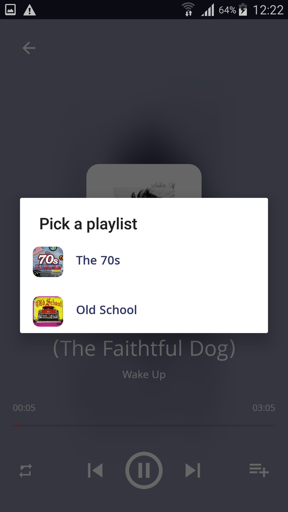

## MusicX Kotlin App

Kotlin Sample App is a sample project that presents modern, 2019 approach to [Android](https://www.android.com/) application development using [Kotlin](https://kotlinlang.org/) and latest tech-stack.

The goal of the project is to demonstrate best practices, provide a set of guidelines, and present modern Android application architecture. This application may look simple, but it
has all of these small details that will set the rock-solid foundation of the larger app suitable for bigger teams and long application lifecycle management.

Screenshots
=================

 
    <kbd>
           
    </kbd>
    <kbd>
        
    </kbd>
    <kbd>
        
    </kbd>
  <kbd></kbd>
  <kbd></kbd>
  <kbd></kbd>

Features
--------

The app displays a list of recipes - family friendly, vegetarian and personal. Users can see details about recipes, and they can put likes to recipes that interest them. 

Other features include creating new personal recipes, changing application background image.

Development Environment
-----------------------

The app is written entirely in Kotlin and uses the Gradle build system.

Architecture
------------

## Project Structure

## Tech-stack

This project takes advantage of many popular libraries, plugins and tools of the Android ecosystem. Most of the libraries are in the stable version.

### Dependencies

The app is built on top of the last year's app. The architecture is built around
[Android Architecture Components](https://developer.android.com/topic/libraries/architecture/).

-   [Jetpack](https://developer.android.com/jetpack):
    -   [Android KTX](https://developer.android.com/kotlin/ktx.html) - provide concise, idiomatic Kotlin to Jetpack and Android platform APIs.
    -   [AndroidX](https://developer.android.com/jetpack/androidx) - major improvement to the original Android [Support Library](https://developer.android.com/topic/libraries/support-library/index), which is no longer maintained.
    -   [Data Binding](https://developer.android.com/topic/libraries/data-binding/) - allows you to bind UI components in your layouts to data sources in your app using a declarative format rather than programmatically.
    -   [Lifecycle](https://developer.android.com/topic/libraries/architecture/lifecycle) - perform actions in response to a change in the lifecycle status of another component, such as activities and fragments.
    -   [LiveData](https://developer.android.com/topic/libraries/architecture/livedata) - lifecycle-aware, meaning it respects the lifecycle of other app components, such as activities, fragments, or services.
    -   [Navigation](https://developer.android.com/guide/navigation/) - helps you implement navigation, from simple button clicks to more complex patterns, such as app bars and the navigation drawer.
    -   [Room](https://developer.android.com/topic/libraries/architecture/room) - persistence library provides an abstraction layer over SQLite to allow for more robust database access while harnessing the full power of SQLite.
    -   [ViewModel](https://developer.android.com/topic/libraries/architecture/viewmodel) - designed to store and manage UI-related data in a lifecycle conscious way. The ViewModel class allows data to survive configuration changes such as screen rotations.
    -   [WorkManager](https://developer.android.com/topic/libraries/architecture/workmanager) - for Android background jobs.
    -   [Glide](https://bumptech.github.io/glide) - for image loading.
    -   [Gson](https://github.com/google/gson) - to convert a JSON string to an equivalent Java object.
    -   [Coroutines](https://kotlinlang.org/docs/reference/coroutines-overview.html) - managing background threads with simplified code and reducing needs for callbacks.
    -   [Timber](https://github.com/JakeWharton/timber) - a logger with a small, extensible API which provides utility on top of Android's normal Log class.
    -   [Android Debug Database](https://github.com/amitshekhariitbhu/Android-Debug-Database) - for debugging databases and shared preferences in Android applications.

## Music

Music provided by the [Free Music Archive](http://freemusicarchive.org/).

- [Irsen's Tale](http://freemusicarchive.org/music/Kai_Engel/Irsens_Tale/) by
[Kai Engel](http://freemusicarchive.org/music/Kai_Engel/).
- [Wake Up](http://freemusicarchive.org/music/The_Kyoto_Connection/Wake_Up_1957/) by
[The Kyoto Connection](http://freemusicarchive.org/music/The_Kyoto_Connection/).

## License

Copyright 2019 Iulian
Licensed under the Apache License, Version 2.0 (the "License");
you may not use this file except in compliance with the License.
You may obtain a copy of the License at

   http://www.apache.org/licenses/LICENSE-2.0

Unless required by applicable law or agreed to in writing, software
distributed under the License is distributed on an "AS IS" BASIS,
WITHOUT WARRANTIES OR CONDITIONS OF ANY KIND, either express or implied.
See the License for the specific language governing permissions and
limitations under the License.
